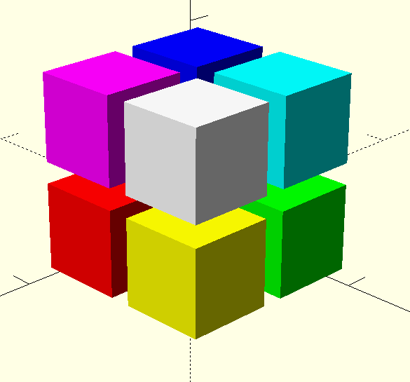
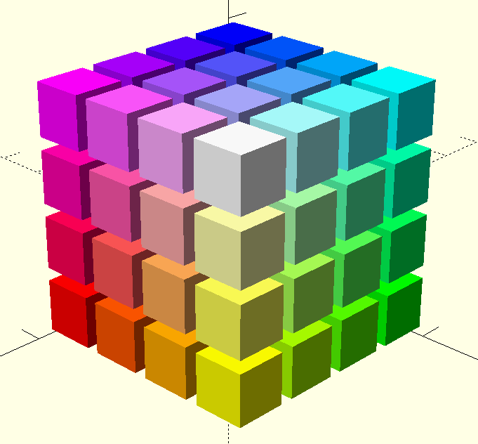

# coloresRGB

Programa para generar colores RGB en OpenSCAD en función del número de bits por canal
https://github.com/Josepujol/coloresRGB/blob/master/RGBcolors.scad

## 1 bit por canal

## 2 bit por canal

Este repositorio es obra de Jose Pujol licencia CC BySA
